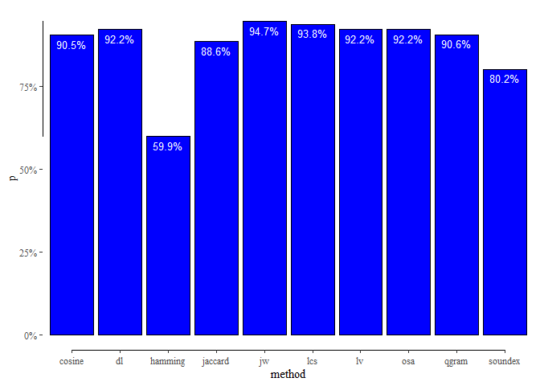

<!-- README.md is generated from README.Rmd. Please edit that file -->

# rMatching

<!-- badges: start -->
<!-- badges: end -->

## Installation

You can install the development version of rMatching from
[GitHub](https://github.com/) with:

``` r
# install.packages("devtools")
devtools::install_github("MatthiasUckert/rMatching")
```

## Build-In Tables

Below The basic steps how to match two data sets

``` r
library(rMatching); library(tidyverse)
#> Loading required package: data.table
#> -- Attaching packages --------------------------------------- tidyverse 1.3.1 --
#> v ggplot2 3.3.5     v purrr   0.3.4
#> v tibble  3.1.6     v dplyr   1.0.8
#> v tidyr   1.2.0     v stringr 1.4.0
#> v readr   2.1.2     v forcats 0.5.1
#> -- Conflicts ------------------------------------------ tidyverse_conflicts() --
#> x dplyr::between()   masks data.table::between()
#> x dplyr::filter()    masks stats::filter()
#> x dplyr::first()     masks data.table::first()
#> x dplyr::lag()       masks stats::lag()
#> x dplyr::last()      masks data.table::last()
#> x purrr::transpose() masks data.table::transpose()
```

The package contains three build-in datasets:

-   table_source: The source table with company names

-   table_target: The target table with company names

-   table_matches: A table in which source and target table are already
    matched

``` r
head(table_source, 3)
#> # A tibble: 3 x 5
#>   id       name                         iso3  city      address                 
#>   <chr>    <chr>                        <chr> <chr>     <chr>                   
#> 1 291C5CB8 ASM INTERNATIONAL NV         NLD   ALMERE    VERSTERKERSTRAAT 8      
#> 2 097A6454 TELEFONAKTIEBOLAGET LM ERICS SWE   STOCKHOLM TORSHAMNSGATAN 21, KISTA
#> 3 0CA8A1F4 NOVO NORDISK A/S             DNK   BAGSVAERD NOVO ALLE 1
```

``` r
head(table_target, 3)
#> # A tibble: 3 x 5
#>   id       name                        iso3  city      address            
#>   <chr>    <chr>                       <chr> <chr>     <chr>              
#> 1 40D62BF9 VOLKSWAGEN AG               DEU   WOLFSBURG BRIEFFACH 1849     
#> 2 18162F6F DAIMLER AG                  DEU   STUTTGART MERCEDESSTRASSE 120
#> 3 47F0DB5C BAYERISCHE MOTOREN WERKE AG DEU   MUENCHEN  PETUELRING 130
```

``` r
head(table_matches, 3)
#> # A tibble: 3 x 11
#>   id_s     id_t    name_s name_t iso3_s iso3_t city_s city_t address_s address_t
#>   <chr>    <chr>   <chr>  <chr>  <chr>  <chr>  <chr>  <chr>  <chr>     <chr>    
#> 1 291C5CB8 1147DB~ ASM I~ ASM I~ NLD    NLD    ALMERE ALMERE VERSTERK~ VERSTERK~
#> 2 0CA8A1F4 BACB9C~ NOVO ~ NOVO ~ DNK    DNK    BAGSV~ BAGSV~ NOVO ALL~ NOVO ALLE
#> 3 80DC386E C201D4~ KONIN~ KONIN~ NLD    NLD    AMSTE~ AMSTE~ PHILIPS ~ AMSTELPL~
#> # ... with 1 more variable: match <dbl>
```

# Matching Pipeline

## Step 1: Prepare Tables

Tables have to b prepared with the function: prep_tables()

Important: Specify the columns you want to match in the argument
**.col**. This must be a named vector (**e** for **exact matching** and
**f** for f**uzzy matching**)

``` r
prep_tables(
  .source = table_source,
  .target = table_target,
  .cols = c(f = "name", e = "iso3", f = "city", f = "address"),
  .fstd = standardize_str,
  .dir = "_debug_data1",
  .range = 10
)
#> 
#> Stored data is complete, tables won't be prepared again
#> 
#> Data is stored ...
```

The relevant tables are stored in the directory (.dir)

``` r
tibble(file = list.files("_debug_data1/tables/")) %>%
  mutate(type = case_when(
    startsWith(file, "s") ~ "Source Table",
    startsWith(file, "s") ~ "Target Table",
    TRUE ~ "Groups"
  )) %>% select(type, file)
#> # A tibble: 11 x 2
#>    type         file       
#>    <chr>        <chr>      
#>  1 Groups       _groups.fst
#>  2 Source Table sdata.fst  
#>  3 Source Table sdups.fst  
#>  4 Source Table sgroup.fst 
#>  5 Source Table snames.fst 
#>  6 Source Table sorig.fst  
#>  7 Groups       tdata.fst  
#>  8 Groups       tdups.fst  
#>  9 Groups       tgroup.fst 
#> 10 Groups       tnames.fst 
#> 11 Groups       torig.fst
```

## Step 2: Match Data

For match_data() you have to reference the directory and the method used
for matching

``` r
match_data(
  .dir = "_debug_data1",
  .max_match = 20,
  .method = "osa",
  .workers = 4,
  .verbose = TRUE
)
#> 
#> Matching exists already, it won't be recalculated
#> NULL
```

Here we match over all methods

``` r
purrr::walk(get_method_names(), ~ match_data("_debug_data1", 20, .x, 4, TRUE))
#> 
#> Matching exists already, it won't be recalculated                               
#> 
#> Matching exists already, it won't be recalculated                               
#> 
#> Matching exists already, it won't be recalculated                               
#> 
#> Matching exists already, it won't be recalculated                               
#> 
#> Matching exists already, it won't be recalculated                               
#> 
#> Matching exists already, it won't be recalculated                               
#> 
#> Matching exists already, it won't be recalculated                               
#> 
#> Matching exists already, it won't be recalculated                               
#> 
#> Matching exists already, it won't be recalculated                               
#> 
#> Matching exists already, it won't be recalculated
```

## Step 3: Score Data

For score_data() you have to give the fuzzy matching columns some
weights

``` r
w <- c(name = .8, city = .1, address = .1)
score_data(
  .dir = "_debug_data1",
  .weights = w ,
  .max_match = 20,
  .method = "osa"
)
#> 
#> Scoring exists already, it won't be recalculated
#> NULL
```

Here we score over all methods

``` r
purrr::walk(get_method_names(), ~ score_data("_debug_data1", w, 20, .x))
#> 
#> Scoring exists already, it won't be recalculated                                
#> 
#> Scoring exists already, it won't be recalculated                                
#> 
#> Scoring exists already, it won't be recalculated                                
#> 
#> Scoring exists already, it won't be recalculated                                
#> 
#> Scoring exists already, it won't be recalculated                                
#> 
#> Scoring exists already, it won't be recalculated                                
#> 
#> Scoring exists already, it won't be recalculated                                
#> 
#> Scoring exists already, it won't be recalculated                                
#> 
#> Scoring exists already, it won't be recalculated                                
#> 
#> Scoring exists already, it won't be recalculated
```

## Step 4: Score Data

select_data() is the only functions that returns a dataframe directly.
You can choose up to which rank you retrueve the data. We directly match
over all methods.

``` r
tab_match <- purrr::map_dfr(
  .x = get_method_names(),
  .f = ~ select_data(
    .dir = "_debug_data1",
    .rank = 1,
    .method = .x
  ), .id = "method"
)
```

# Matching Comparison

``` r
.matches <- select(mutate(table_matches, match = 1), id_s, id_t, match)
tab_comparison <- left_join(tab_match, .matches, by = c("id_s", "id_t")) %>%
  replace_na(list(match = 0)) %>%
  group_by(method) %>%
  summarise(p = sum(match) / n())
```

``` r
tab_comparison %>%
  mutate(label = scales::percent(p, .1)) %>%
  ggplot(aes(method, p)) + 
  geom_col(fill = "blue", color = "black") + 
  ggthemes::geom_rangeframe() + 
  ggthemes::theme_tufte() +
  scale_y_continuous(labels = scales::percent) +
  geom_text(aes(label = label), vjust = 1.5, colour = "white", size = 3.5)
```



# Legal Form Adjustment

We can also adjust the lagel form upfront, and will do so for the bedt
method “jw”

``` r
tab_source_lf <- extract_legal_form(
  .tab = table_source,
  .col = "name",
  .workers = 4
)

tab_target_lf <- extract_legal_form(
  .tab = table_source,
  .col = "name",
  .workers = 4
)
```

``` r
head(tab_source_lf, 3)
#> # A tibble: 3 x 10
#>   id       name          name_adj name_std iso3  city  address lfo   lfs   lfid 
#>   <chr>    <chr>         <chr>    <chr>    <chr> <chr> <chr>   <chr> <chr> <chr>
#> 1 291C5CB8 ASM INTERNAT~ ASM INT~ ASM INT~ NLD   ALME~ VERSTE~ NV    NV    E0749
#> 2 097A6454 TELEFONAKTIE~ TELEFON~ TELEFON~ SWE   STOC~ TORSHA~ <NA>  <NA>  <NA> 
#> 3 0CA8A1F4 NOVO NORDISK~ NOVO NO~ NOVO NO~ DNK   BAGS~ NOVO A~ A S   A S   G0625
```

``` r
head(tab_target_lf, 3) 
#> # A tibble: 3 x 10
#>   id       name          name_adj name_std iso3  city  address lfo   lfs   lfid 
#>   <chr>    <chr>         <chr>    <chr>    <chr> <chr> <chr>   <chr> <chr> <chr>
#> 1 291C5CB8 ASM INTERNAT~ ASM INT~ ASM INT~ NLD   ALME~ VERSTE~ NV    NV    E0749
#> 2 097A6454 TELEFONAKTIE~ TELEFON~ TELEFON~ SWE   STOC~ TORSHA~ <NA>  <NA>  <NA> 
#> 3 0CA8A1F4 NOVO NORDISK~ NOVO NO~ NOVO NO~ DNK   BAGS~ NOVO A~ A S   A S   G0625
```

Now we use the name_adj column for the matching which is the company
name without its legal form. Additionally, we also fuzzy match on the
legal form (we have to fuzzy match, because requiring exactly the same
legal form is to strict)

``` r
prep_tables(
  .source = tab_source_lf,
  .target = tab_target_lf,
  .cols = c(f = "name_adj", e = "iso3", f = "city", f = "address", f = "lfs"),
  .fstd = standardize_str,
  .dir = "_debug_data2",
  .range = 10
)
#> 
#> Stored data is complete, tables won't be prepared again
#> 
#> Data is stored ...
```

``` r
match_data(
  .dir = "_debug_data2",
  .max_match = 20,
  .method = "jw",
  .workers = 4,
  .verbose = TRUE
)
#> 
#> Matching exists already, it won't be recalculated
#> NULL
```

``` r
w <- c(name_adj = .8, city = .1, address = .05, lfs = .05)
score_data(
  .dir = "_debug_data2",
  .weights = w ,
  .max_match = 20,
  .method = "jw"
)
#> 
#> Scoring exists already, it won't be recalculated
#> NULL
```

``` r
tab_match_lf <- select_data(
  .dir = "_debug_data1",
  .rank = 1,
  .method = "jw"
) %>%
  mutate(method = "jw-lf") %>%
  bind_rows(tab_match)
```

# Matching Comparison

``` r
.matches <- select(mutate(table_matches, match = 1), id_s, id_t, match)
tab_comparison <- left_join(tab_match_lf, .matches, by = c("id_s", "id_t")) %>%
  replace_na(list(match = 0)) %>%
  group_by(method) %>%
  summarise(p = sum(match) / n())
```

``` r
tab_comparison %>%
  mutate(label = scales::percent(p, .1)) %>%
  mutate(fill = if_else(method == "jw-lf", "red", "blue")) %>%
  ggplot(aes(method, p, fill = fill)) + 
  geom_col(color = "black") + 
  scale_fill_manual(name = "method", values=c("blue","darkred")) +
  ggthemes::geom_rangeframe() + 
  ggthemes::theme_tufte() +
  scale_y_continuous(labels = scales::percent) +
  geom_text(aes(label = label), vjust = 1.5, colour = "white", size = 3.5) + 
  theme(legend.position = "none")
```


