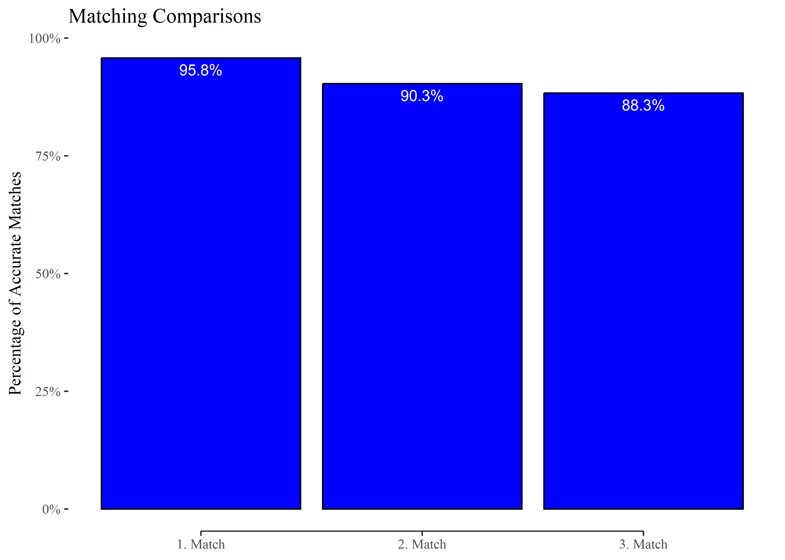

<!-- README.md is generated from README.Rmd. Please edit that file -->

# rMatching

<!-- badges: start -->
<!-- badges: end -->

## Installation

You can install the development version of rMatching from
[GitHub](https://github.com/) with:

``` r
# install.packages("devtools")
devtools::install_github("MatthiasUckert/rMatching")
```

## Build-In Tables

Below The basic steps how to match two data sets

``` r
library(rMatching); library(tidyverse); library(tictoc)
#> Loading required package: data.table
#> -- Attaching packages --------------------------------------- tidyverse 1.3.2 --
#> v ggplot2 3.4.0     v purrr   1.0.1
#> v tibble  3.1.8     v dplyr   1.1.0
#> v tidyr   1.3.0     v stringr 1.5.0
#> v readr   2.1.3     v forcats 1.0.0
#> -- Conflicts ------------------------------------------ tidyverse_conflicts() --
#> x dplyr::between()   masks data.table::between()
#> x dplyr::filter()    masks stats::filter()
#> x dplyr::first()     masks data.table::first()
#> x dplyr::lag()       masks stats::lag()
#> x dplyr::last()      masks data.table::last()
#> x purrr::transpose() masks data.table::transpose()
#> 
#> Attaching package: 'tictoc'
#> 
#> 
#> The following object is masked from 'package:data.table':
#> 
#>     shift
```

The package contains three build-in datasets:

- table_source: The source table with company names

- table_target: The target table with company names

- table_matches: A table in which source and target table are already
  matched

``` r
head(table_source, 3)
#> # A tibble: 3 x 6
#>   id       name                         iso3  city      address            size 
#>   <chr>    <chr>                        <chr> <chr>     <chr>              <chr>
#> 1 291C5CB8 ASM INTERNATIONAL NV         NLD   ALMERE    VERSTERKERSTRAAT 8 large
#> 2 097A6454 TELEFONAKTIEBOLAGET LM ERICS SWE   STOCKHOLM TORSHAMNSGATAN 21~ small
#> 3 0CA8A1F4 NOVO NORDISK A/S             DNK   BAGSVAERD NOVO ALLE 1        small
```

``` r
head(table_target, 3)
#> # A tibble: 3 x 6
#>   id       name                        iso3  city      address             size 
#>   <chr>    <chr>                       <chr> <chr>     <chr>               <chr>
#> 1 40D62BF9 VOLKSWAGEN AG               DEU   WOLFSBURG BRIEFFACH 1849      midd~
#> 2 18162F6F DAIMLER AG                  DEU   STUTTGART MERCEDESSTRASSE 120 small
#> 3 47F0DB5C BAYERISCHE MOTOREN WERKE AG DEU   MUENCHEN  PETUELRING 130      midd~
```

``` r
head(table_matches, 3)
#> # A tibble: 3 x 11
#>   id_s     id_t  name_s name_t iso3_s iso3_t city_s city_t addre~1 addre~2 match
#>   <chr>    <chr> <chr>  <chr>  <chr>  <chr>  <chr>  <chr>  <chr>   <chr>   <dbl>
#> 1 291C5CB8 1147~ ASM I~ ASM I~ NLD    NLD    ALMERE ALMERE VERSTE~ VERSTE~     1
#> 2 0CA8A1F4 BACB~ NOVO ~ NOVO ~ DNK    DNK    BAGSV~ BAGSV~ NOVO A~ NOVO A~     1
#> 3 80DC386E C201~ KONIN~ KONIN~ NLD    NLD    AMSTE~ AMSTE~ PHILIP~ AMSTEL~     1
#> # ... with abbreviated variable names 1: address_s, 2: address_t
```

# Matching Pipeline

## Step 1: Prepare Tables

Tables have to be prepared with the function: **prep_tables()**

**Inputs:**

1.  **`.source`**: The Source Table - This is the table containing the
    names you want to match. These names will be compared to those in
    the target table to identify potential matches.

2.  **`.target`**: The Target Table - This table contains the names to
    which the source table names will be matched. The function aims to
    find corresponding names in the target table for each name in the
    source table.

3.  **`.fstd`**: Standardization Function - This is a user-defined or
    built-in function used to standardize the names in both source and
    target tables. By default, the function uses the built-in
    **`standardize_str`** function for this purpose.

4.  **`.dir`**: Data Storage Directory - This parameter specifies the
    directory where the processed data will be stored, allowing for easy
    access and review of the intermediate data files.

5.  **`.return`**: Return Tables as List - This is a boolean flag that
    determines whether the processed source and target tables should be
    returned as a list. If set to **`TRUE`**, the function will return
    the tables; otherwise, it will only store them in the specified
    directory.

6.  **`.verbose`**: Verbose Output - This boolean flag controls the
    display of additional information during the function’s execution.
    If set to **`TRUE`**, the function will print extra details, which
    can be useful for troubleshooting and understanding the matching
    process.

``` r
prep_tables(
  .source = table_source,
  .target = table_target,
  .fstd = standardize_str,
  .dir = "_debug_data",
  .return = FALSE,
  .verbose = TRUE
)
#> 
#> Preparing Source Table ...
#> 
#> Preparing Target Table ...
#> 
#> Data is stored ...
```

The relevant tables are stored in the directory (.dir)

``` r
tibble(file = list.files("_debug_data/tables/")) %>%
  mutate(type = case_when(
    startsWith(file, "s") ~ "Source Table",
    startsWith(file, "s") ~ "Target Table",
    TRUE ~ "Groups"
  )) %>% select(type, file)
#> # A tibble: 4 x 2
#>   type         file     
#>   <chr>        <chr>    
#> 1 Source Table sdata.fst
#> 2 Source Table sorig.fst
#> 3 Groups       tdata.fst
#> 4 Groups       torig.fst
```

## Step 2: Match Data

The Matching can be now performed with the function **match_data()**

Inputs:

1.  **`.dir`** Data Storage Directory - This parameter specifies the
    directory in which the processed data will be stored. It enables
    easy access and review of the intermediate data files created during
    the matching process.

2.  **`.cols`** Named Vector for Columns - This parameter is a named
    vector containing the columns to be considered for matching. The
    names in the vector should be either “e” or “exact” for an exact
    comparison of the strings, or “f” or “fuzzy” for a fuzzy matching
    approach as specified by the .method argument. Names in the vector
    can be either quoted or unquoted, while the values must be quoted.

3.  **`.range`** Character Range - This parameter defines the range of
    characters to be considered when matching names. For example, if a
    name in the source table has 10 characters and .range is set to 5,
    any name within the 5-15 character range in the target table will be
    considered for matching.

4.  **`.weights`** Column Weights - This named vector assigns weights to
    each column used for matching. If not specified, all columns will be
    assigned equal weights by default.

5.  **`.max_match`** Maximum Matches - This parameter determines the
    maximum number of matches to be returned for each record in the
    source table.

6.  **`.allow_mult`** Multiple Match Permission - This boolean parameter
    indicates whether multiple matches are allowed for each record in
    the target table. If you want a 1-1 match, set it to FALSE; for a
    1-n match, set it to TRUE.

7.  **`.method`** Matching Method - This parameter specifies the method
    to be used for matching records. It can be one of the following:
    “osa”, “lv”, “dl”, “hamming”, “lcs”, “qgram”, “cosine”, “jaccard”,
    “jw”, or “soundex”. For more information on these methods, refer to
    the stringdist-metrics documentation in the {stringdist} package.

8.  **`.workers`** Parallel Workers - This parameter defines the number
    of workers to be used for parallelization during the matching
    process.

9.  **`.mat_size`** Maximum Matrix Size - This parameter sets the
    maximum size of the similarity matrix created during the fuzzy
    matching process. If you are dealing with a large number of names to
    match, the matrix can become very large. Adjust this value to avoid
    overloading your system’s memory.

10. **`.verbose`** Verbose Output - This boolean flag determines whether
    additional information is displayed during the execution of the
    function. If set to TRUE, the function will output extra details,
    which can be helpful for troubleshooting and gaining insights into
    the matching process.

``` r
tictoc::tic("Match 1")
```

``` r
match1 <- match_data(
  .dir = "_debug_data",
  .cols = c(f = "name", e = "iso3", f = "city", f = "address", e = "size"),
  .range = 10,
  .weights = c(name = 0.8, city = 0.1, city = 0.1),
  .max_match = 25,
  .allow_mult = FALSE,
  .method = "osa",
  .workers = 4,
  .mat_size = 1e6,
  .verbose = TRUE
)
#> 
#> Transforming tables and retrieving groups
#> 
#> Matching source table to target table ...
#> 
#> Adjusting similarity scores
#> 
#> Finalizing output ...
#> 
#> Calculating scores
#> 
#> Adjusting scores
#> 
#> Finalizing output
```

``` r
tictoc::toc()
#> Match 1: 46.77 sec elapsed
```

The output looks the following:

``` r
head(match1)
#> # A tibble: 6 x 15
#>   id_s     id_t  score rank_~1 rank_~2 name_s name_t iso3_s iso3_t city_s city_t
#>   <chr>    <chr> <dbl>   <int>   <int> <chr>  <chr>  <chr>  <chr>  <chr>  <chr> 
#> 1 000F8750 E48E~ 1           1       1 NTR H~ NTR H~ DNK    DNK    COPEN~ COPEN~
#> 2 000F8750 1749~ 0.669       2       2 NTR H~ NEWCA~ DNK    DNK    COPEN~ KOBEN~
#> 3 000F8750 6A2E~ 0.579       4       3 NTR H~ LOYAL~ DNK    DNK    COPEN~ COPEN~
#> 4 002FCAB5 FF13~ 1           1       1 VIROG~ VIROG~ DNK    DNK    BIRKE~ BIRKE~
#> 5 002FCAB5 45C4~ 0.394       3       2 VIROG~ PHOTO~ DNK    DNK    BIRKE~ ROSKI~
#> 6 0051857E 9E94~ 0.76        1       1 GAUMO~ GAUMO~ FRA    FRA    NEUIL~ NEUIL~
#> # ... with 4 more variables: address_s <chr>, address_t <chr>, size_s <chr>,
#> #   size_t <chr>, and abbreviated variable names 1: rank_old, 2: rank_new
```

The output contains the following relevant columns: id_s: The ID of the
source table id_t: The ID of the target table score: similarity score
rank_old: Unadjusted Rank rank_new: Adjusted Rank (only relevant if
.allow_mult = FALSE, than the rank will consider the best match of a
name considering all the other matches)

Note \_t stands for the column in the target table and \_s for the
columns in the source table

The matching is now already stored, so if you just want to change for
example the weights, the calculation will be almost instant.

``` r
tictoc::tic("Match 2")
```

``` r
match2 <- match_data(
  .dir = "_debug_data",
  .cols = c(f = "name", e = "iso3", f = "city", f = "address", e = "size"),
  .range = 10,
  .weights = c(name = 0.5, city = 0.4, city = 0.1), # Changed Weights
  .max_match = 25,
  .allow_mult = FALSE,
  .method = "osa",
  .workers = 4,
  .mat_size = 1e6,
  .verbose = TRUE
)
#> 
#> Matching already exists
#> 
#> Calculating scores
#> 
#> Adjusting scores
#> 
#> Finalizing output
```

``` r
tictoc::toc()
#> Match 2: 0.53 sec elapsed
```

But if you want to change the columns, the function has to cache another
matching

``` r
tictoc::tic("Match 1")
```

``` r
match3 <- match_data(
  .dir = "_debug_data",
  .cols = c(f = "name", e = "iso3", f = "city", f = "address"),
  .range = 10,
  .weights = c(name = 0.5, city = 0.4, city = 0.1),
  .max_match = 25,
  .allow_mult = FALSE,
  .method = "osa",
  .workers = 4,
  .mat_size = 1e6,
  .verbose = TRUE
)
#> 
#> Transforming tables and retrieving groups
#> 
#> Matching source table to target table ...
#> 
#> Adjusting similarity scores
#> 
#> Finalizing output ...
#> 
#> Calculating scores
#> 
#> Adjusting scores
#> 
#> Finalizing output
```

``` r
tictoc::toc()
#> Match 1: 28.55 sec elapsed
```

# Deduplicating Matches

The Outputs of the matching tables is still not unique. We can easily
deduplicate them by setting rank_new ==

``` r
match1_unique <- filter(match1, rank_new == 1)
match2_unique <- filter(match2, rank_new == 1)
match3_unique <- filter(match3, rank_new == 1)
```

we can quickly check that we have unique 1-1 matches with the function
filter_dups() which return s a dataframe with all duplicates

``` r
nrow(filter_dups(match1_unique, id_s, id_t))
#> [1] 0
nrow(filter_dups(match2_unique, id_s, id_t))
#> [1] 0
nrow(filter_dups(match3_unique, id_s, id_t))
#> [1] 0
```

# Matching Comparison

Let us now see how good the matching library performs. We calculated 3
different matches which we stired in match1, match2, and match3.

First we load the pre-stored matches and combine all the matches to a
single table

``` r
.matches <- select(mutate(table_matches, match = 1), id_s, id_t, match)
```

``` r
tab_matches <- bind_rows(
  mutate(match1_unique, no = "1. Match"),
  mutate(match2_unique, no = "2. Match"),
  mutate(match3_unique, no = "3. Match")
)
```

``` r
tab_comparison <- left_join(tab_matches, .matches, by = c("id_s", "id_t")) %>%
  replace_na(list(match = 0)) %>%
  group_by(no) %>%
  summarise(p = sum(match) / n())
```

``` r
tab_comparison %>%
  mutate(label = scales::percent(p, .1)) %>%
  ggplot(aes(no, p)) + 
  geom_col(fill = "blue", color = "black") + 
  ggthemes::geom_rangeframe() + 
  ggthemes::theme_tufte() +
  scale_y_continuous(labels = scales::percent) +
  geom_text(aes(label = label), vjust = 1.5, colour = "white", size = 3.5)
```


